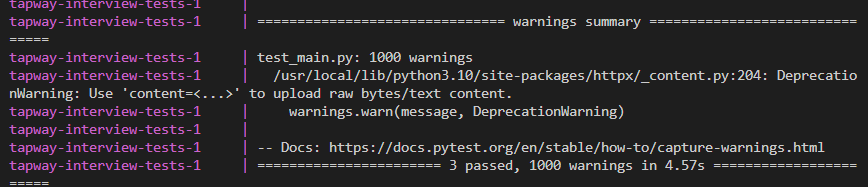
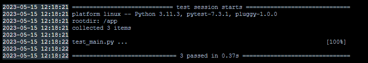

# tapway-interview
First and foremost, I would like to express my sincere gratitude to Tapway for providing me with the opportunity to complete the take-home assessment for the Python Backend Developer position. It was an enriching experience, and I am grateful for the chance to showcase my skills and knowledge.

This project demonstrate a high performance docker compose fastapi, rabbitmq producer and async consumer microservice.
- Users post an api to FastAPI 
- FastAPI produce a message into message 
- Consumer using asyncio.run to consume the message, process and save into csv
- Several tests are perform to test about the performance of overall project and consumer

## How To Run
``` bash
docker-compose up --build

docker-compose down -v
```

> If you try to rerun `docker-compose up` without `docker-compose down -v`, the test container will fail due `preds_per_message * number_message` is **not match** with `csv_count`.

> No worries about missing heartbeats from client error in rabbitmq, it will eventually restart the connection once users call APIs

> After running all thing, you could go into `producer` or `consumer` to check about csv data.
```bash
docker-compose exec consumer sh
ls data
cd data
cat data.csv
cat test_data.csv
```


## Project Structure
```
tapway-interview
├─ README.md
├─ docker-compose.yml
├─ assets
│  └─ demo.gif
├─ consumer
│  ├─ Dockerfile
│  ├─ Pipfile
│  ├─ Pipfile.lock
│  ├─ __init__.py
│  ├─ handle_mq_exception.py
│  ├─ main.py
│  └─ requirements.txt
└─ producer
   ├─ .pytest_cache
   │  ├─ CACHEDIR.TAG
   │  └─ README.md
   ├─ Dockerfile
   ├─ Pipfile
   ├─ Pipfile.lock
   ├─ main.py
   ├─ model
   │  ├─ payload.py
   │  └─ publisher.py
   ├─ requirements.txt
   └─ test_main.py
```

## Project Images
With the docker-compose up --build, rabbimq will be started. producer, consumer and tests will be start only after rabbimq's status become `service-healthy`.

### RabbitMQ 
rabbitmq:3-management-alpine was pulled and started

### Volume
The data.csv file is stored in `data-volume` volume which is `/app/data`, every container including `Tests` container. 

### Producer 
Producer have a `/process` POST API to publish message into RabbitMQ, the API will instance return status code 200 once the message is publish to the RabbitMQ.

### Consumer 
Consumer subscribed to rabbitmq channel, preprocess it and append it into csv file. The delimiter used for csv is ";" because "tags" column is using "," to seperate multiple tags.

**aio_pika** and **asyncio** are used for concurrent purpose to consume message faster

**Manual acknowledgement**  is employed to prevent `data loss` due to the `consumers fail or loss connection`, however it has `lower throughput` compare to automatic acknowledgement.

### Tests
Tests container will run the `test_main.py` file in producer by using 
```bash
pytest
```
It will call 1,000 APIs with `1~10 preds` per API call to producer API and producer message into RabbitMQ. Tt able to call 1,000 apis and data will be preprocessed and stored within 6s.

### Tests-Consumer
As same as `Tests` it run test_main.py to start testing. But the key different is it only test the performance of consumer. Tests-consumer uses `MagicMock(spec=aio_pika.IncomingMessage)` and consume the mock data directly without publish.


 




